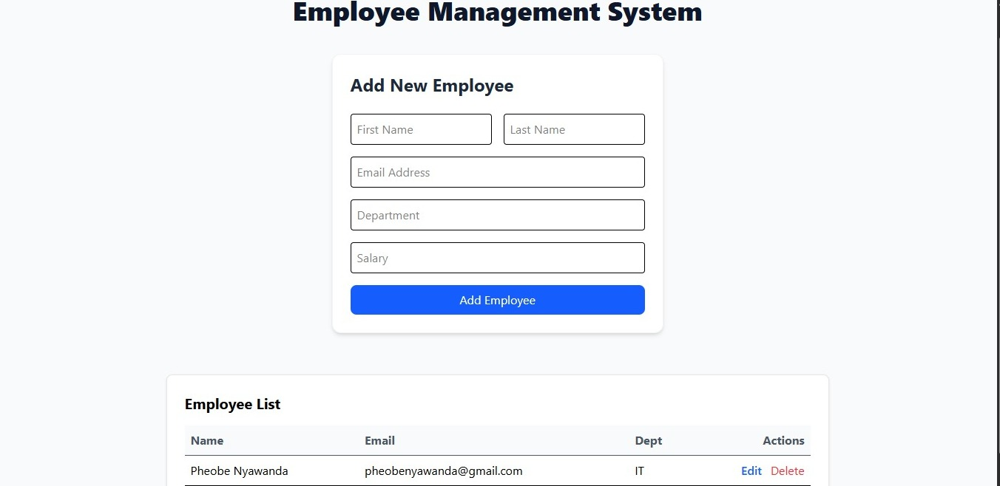

<h1 align="center">Employee Management System (EMS)</h1>

A full-stack CRUD application built with Spring Boot and React. 
Demonstrates clean architecture, RESTful API design, and a responsive frontend.

<h2>Overview</h2>

The Employee Management System allows users to manage employee records through a simple interface.
It showcases integration between a Spring Boot backend and a React frontend.

<h2 align="center">Application Preview</h2>

  

<h2>Features</h2>
<ul>
  <li>Create, view, and delete employee records</li>
  <li>Real-time UI updates using React state</li>
  <li>Structured backend error handling</li>
  <li>Responsive UI with Tailwind CSS</li>
</ul>

<h2>Tech Stack</h2>

<h3>Backend</h3>
<ul>
  <li>Spring Boot</li>
  <li>Java 17+</li>
  <li>Spring Data JPA</li>
  <li>MySQL</li>
</ul>

<h3>Frontend</h3>
<ul>
  <li>React (Vite)</li>
  <li>Tailwind CSS v4</li>
  <li>PostCSS</li>
  <li>Fetch API</li>
</ul>

<h2>Project Structure</h2>

<pre>
assessment-project/

backend/
  src/main/java/com/api/
    controller/        # Handles HTTP requests
    service/           # Business logic
    model/             # JPA entities
    repository/        # Database access
    exception/         # Error handling

  src/main/resources/
    application.properties

  mvnw

frontend/
  src/
    components/
      EmployeeForm.jsx
      EmployeeList.jsx
    App.jsx
    index.css

  tailwind.config.js
  postcss.config.js
  package.json

README.md
</pre>

<h2>Setup</h2>

<h3>Database</h3>
<pre><code>CREATE DATABASE assessment_db;</code></pre>

Update credentials in:

<pre><code>backend/src/main/resources/application.properties</code></pre>

<h3>Run Backend</h3>
<pre><code>cd backend
./mvnw spring-boot:run</code></pre>

Runs on: http://localhost:8080

<h3>Run Frontend</h3>
<pre><code>cd frontend
npm install
npm run dev</code></pre>

Runs on: http://localhost:5173

<h2>API Endpoints</h2>

<table>
  <tr>
    <th>Method</th>
    <th>Endpoint</th>
    <th>Description</th>
  </tr>
  <tr>
    <td>GET</td>
    <td>/api/employees</td>
    <td>Retrieve all employees</td>
  </tr>
  <tr>
    <td>POST</td>
    <td>/api/employees</td>
    <td>Create a new employee</td>
  </tr>
  <tr>
    <td>DELETE</td>
    <td>/api/employees/{id}</td>
    <td>Delete an employee</td>
  </tr>
</table>

<h2>Author</h2>

Neriah Nn

